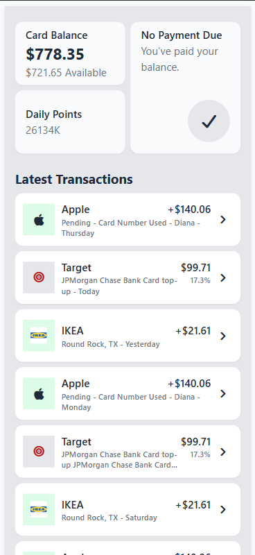

Ось гарно відформатований README у Markdown форматі, який можна вставити прямо у файл `README.md`:

---

# 💳 Wallet App

## 📘 About the Project

This is a **test task** for the **Magnoli / Get Report** position.

The project is a **simple mobile web app** built with **Vite + React + TypeScript + Tailwind CSS**.
It implements two main screens based on the test requirements:

- **TransactionsList** — displays balance info, daily points, and a list of transactions.
- **TransactionDetail** — shows full transaction details when a transaction item is clicked.

All data is loaded from a local JSON file:
`src/data/transactions.json`

---

## ⚙️ Tech Stack

- ⚡ **Vite** — fast and modern build tool
- ⚛️ **React 19 + TypeScript** — for scalable, type-safe UI components
- 🎨 **Tailwind CSS** — utility-first styling and responsive design
- 🔣 **FontAwesome** — for icons
- 💾 **JSON mock data** — local transaction dataset

---

## 🚀 How to Run Locally

### 1️⃣ Clone the repository

```bash
git clone https://github.com/<your-username>/wallet-app.git
cd wallet-app
```

### 2️⃣ Install dependencies

```bash
npm install
```

### 3️⃣ Run the development server

```bash
npm run dev
```

Then open the link from your terminal — usually:
👉 [http://localhost:5173](http://localhost:5173)

---

## 🧩 Build for Production

```bash
npm run build
```

The optimized build will be created in the **`/dist`** folder.

---

## 📸 Screenshots

**TransactionsList**


> _(Displays balance, points, and transaction list)_

**TransactionDetail**


> _(Shows detailed transaction information)_

---

## ✅ Features

- Displays mock transaction data from JSON
- Fully responsive mobile-first layout
- Clean and minimal UI with Tailwind best practices
- Functional navigation between list and detail screens
- Dynamic daily points calculation

---

## 🧠 Notes

- Developed using **Vite** for ultra-fast startup and HMR
- Designed for **mobile-first** experience (as required)
- Total development time: _under 3 hours_

---

## 👨‍💻 Author

**Anna Rychkova**
📅 _5 November 2025_
